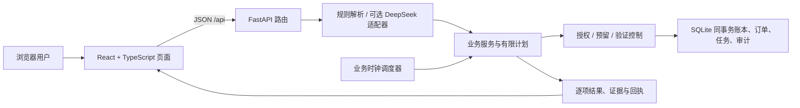

# VeraLane 技术文档

版本：参赛原型交付稿 | 日期：2026-10-04 | 仓库：私有 GitHub `yeniwu46-max/VeraLane`

## 1. 项目定位与边界

VeraLane 是运行于本机的金融业务智能体原型。用户以自然语言表达查询或业务目标；解析器生成结构化草稿，服务端查询虚构账本并核对联系人、余额、规则和快照；需要变更时先展示授权内容，取得确认后才由确定性工具写入 SQLite 并返回回执。模型不拥有执行权限。

当前默认 `VERALANE_MODEL_MODE=offline`。DeepSeek 适配器仍可配置，但 2026-10-03 的三条小样本请求均因 HTTP 401 退回本地规则。样本数量不足以衡量语言理解准确率。所有银行账户、卡、商品、交易、净值和验证码均为模拟数据；系统没有连接真实银行、支付机构、商户配送或真实身份验证服务。

## 2. 系统架构



后端以 FastAPI + SQLite 实现。各场景模块通过 `init_schema(conn)` 创建自己的表；资金执行在 `BEGIN IMMEDIATE` 写事务中提交，多人结算计划创建/逐笔授权及会生成提醒的查询会在读取前取得写锁，避免并发调度下的读写锁升级冲突。开发时 Vite `/api` 代理至 8000；演示构建后 FastAPI 只挂载 `frontend/dist` 静态目录，API 注册在静态挂载之前。部署脚本绑定 `127.0.0.1`，不面向公网。

| 模块 | 责任 |
| --- | --- |
| `agent.py` / `service.py` | 受限意图、离线回退、聊天路由、确认分发、转账/代扣/账单基础服务 |
| `insights.py` / `bill_preferences.py` | 确定性账单筛选、同期比较、异常线索、分类覆盖、预算与预测 |
| `subscription_intelligence.py` / `plans.py` | 代扣周期诊断、提醒、逐项取消以及有版本的支出优化任务 |
| `execution_controls.py` | 资金可用额、预留/消费/释放、红级挑战、验证和授权快照 |
| `aliases.py` / `recurring.py` | 用户确认的收款人别名、相似付款提示、有限周期和批量转账 |
| `aa_settlement.py` | 本地多人垫付净额计算、计划持久化与本人相关结算路径的逐笔授权执行 |
| `cards.py` | 虚构卡状态与实际模拟刷卡通道校验、申请/审批/发卡分态 |
| `life_tasks.py` / `jobs.py` | 固定白名单生日订单流程、业务事件排序与演示时钟推进 |
| `investments.py` | 固定虚构产品、风险问卷、申购持仓、赎回份额和到期结算 |
| `frontend/src/*Panel.tsx` | 分场景列表/表单/证据窗口；`OperationConfirm` 统一授权确认及挑战 UI |

## 3. 主要 API

所有写接口接受 `session_id` 并在服务端重新校验；会话 ID 当前只是任务隔离字段，不是身份认证凭据。完整 schema 可通过本机启动后的 `/docs` 查看。

| 路由前缀 | 核心端点 / 能力 |
| --- | --- |
| `/api/chat` | 自然语言意图、规则回复、账单问答及跨页面工作流跳转 |
| `/api/transfers` | `/prepare`、联系人消歧、`/recurring/*` 有限周期、`/batch/*` 多收款人草稿/确认 |
| `/api/aa` | `/interpret`、`/preview`、`/prepare`、收款单查询/关闭、显式模拟付款、`/installments` 分次回款、`/requests/{request_id}/refund/prepare` 回款退款；预览/建单可选择 `itemized_items` 按菜品分摊；多人结算支持 `/settlements/preview`、`/prepare`、保存计划查询和 `/settlements/{settlement_id}/legs/{leg_id}/prepare` 逐笔本人授权 |
| `/api/insights`、`/api/bills` | 账单问答/报告与 CSV、JSON 导出 |
| `/api/subscriptions` | `/diagnostics`、`/prepare-batch`、提醒与逐项协议取消 |
| `/api/plans` | 支出计划预览、版本选择、授权准备、失效、执行与取消 |
| `/api/aliases` | 昵称解释、显式保存/删除草稿、丢弃旧授权 |
| `/api/cards` | 卡片快照、变更预览、模拟刷卡、申请、审批、发卡 |
| `/api/funds`、`/api/actions` | 资金状态、预留/释放准备、挑战生成与验证码核验 |
| `/api/life` | 商品目录、生日任务草稿、预留/取消、订单独立退款准备 |
| `/api/investments` | 风险问卷、产品筛选、组合查询、申购/赎回准备和自然语句解释 |
| `/api/bill-preferences` | 单笔归类覆盖、预算增改删、未来 30 天现金预测 |
| `/api/demo/events` | 查看共享演示时钟的本人事件并显式推进至全局下一事件 |

## 4. 核心算法与资金口径

### 4.1 金额与比较

账户金额全程用整数分计算，输入解析为十进制且拒绝超过两位小数、非有限值或越界值。账单报告按选定日期边界筛选，比较区间等长并截取到实际已覆盖日期；基期为零时不生成百分比。分类与异常均由服务端确定性规则计算，异常只是复核线索，不是欺诈判断。

分类修正写入覆盖记录，保留原交易分类、修正前后值、原因和版本；不改源流水金额或方向。账单总览、洞察和预算读取有效分类。预估现金流区分账面余额、当前预留、单次及周期授权转账、已知协议扣费和待结算赎回；周期计划只计父授权、期次、金额、对象和窗口均符合快照的未来期次。代扣金额是估计，不视为已扣现金；AA 未收款不计为可用收入；已预留资金不会二次扣减可用额。

### 4.2 AA 分摊

AA 金额单位为分。系统仅创建请求，不从付款人账户扣款；自述垫付也不增加余额。支持均分、逐人手动金额、用户明确录入的非负整数比例，以及从自然语言中提取的显式逐人份数（例如“我一份、林悦两份”）。份数或百分比只有在覆盖本人和全部参与人、联系人均唯一且权重非全零时才预填；百分比目前仅自动识别整数值，且必须合计 100%；小数百分比、混合写法、歧义或缺项均要求用户手动核对，不推测权重。比例份额以整数分计算，按最大余数法分配余分，余数相同时按参与者顺序稳定处理；每人金额与分摊方式写入授权快照，并在确认时重算核对。手工份额必须覆盖参与人且合计等于总额。只有显式触发的模拟回款写收入交易。全额支付以请求 ID 唯一约束避免重复入账；分次支付以客户端幂等编号做唯一键，服务端在写入前核对联系人、收款请求、操作快照及个人/收款单剩余金额，并在同一 SQLite 写事务内增加余额、插入交易与回款记录、更新状态。收到部分金额时请求仍待收但回执标为“部分到账”；最后一期或付清余额更新为已到账。每一笔都保留独立交易编号。未结收款单在确认时显示提醒日期，业务演示日期三天后生成一条幂等站内提醒；推进共享演示时钟触发提醒，只提示打开 AA 核对实时余额，不发送消息。提醒会随单据状态显示待收、部分收取、已收齐或已关闭，且可标记已读。

按菜品分摊允许最多 100 条明细，每条需有非空菜名、正金额和至少一位本次参与者；菜品金额之和必须等于垫付总额。用户可手动录入，或选择不超过 20 MB、2000 万像素的 JPEG/PNG/WebP 图片；浏览器本地缩放/压缩后，将不超过 900 KB 的 JPEG 发送到本机回环服务，由本机 RapidOCR 识别菜名、金额和小票总额候选。900 KB 约束低于 multipart 临时文件的 1 MB 内存阈值；图片只在本机内存中解码和推理，不落盘、不调用外部识别服务。模型输出是不可直接执行的草稿，用户必须核对每行、亲自选择参与人并保证金额合计匹配垫付总额。含多个金额的行不自动拆分，低置信度行不会成为候选。服务端按“本人优先、其余按确认后的联系人顺序”将每道菜金额均分到整数分，余分依序加一分，再汇总为个人份额。菜名、原金额、参与人和逐道分币结果写入授权快照；确认时重算并比对，收款单及明细弹窗保留菜品分摊回执。OCR 可能漏识、误识或错读小数，不能替代核对原票。

已付清请求的每笔模拟到账均可单独准备部分或全额退款；必须引用该请求下的原收入流水，退款不得超过该笔流水剩余可退金额。服务端确认前及执行时都重读收款单、已验证联系人、到账流水和可退额；执行还检查可用余额（扣除预留），退款大于 ¥1,000 需要独立模拟强验证。确认后在同一写事务中借记余额、创建 AA 退款支出流水、保存退款记录并写审计；唯一 action ID 防重复入账。原收入与原消费流水保留，请求仍保持已付清，退款不会自动形成新应收或向联系人通知。账单净回款、净垫付按退款调整，退款仍可追溯到原到账流水。该流程只用于本地模拟，不访问付款人账户。

多人垫付接受 2–8 位参与者与最多 100 笔明确付款记录。先把每笔金额转为整数分，再按参与者顺序分配均分余数；每人的净额为“累计实付 − 应摊”。债务人与债权人按固定顺序贪心抵消，输出净额一致的建议转账路径。黄色级确认保存不可变计划，执行时重算垫付、联系人指纹与路径。经过本人账户的路径分别创建单笔操作：本人付款复核可用余额、预留和当日转账累计，累计超过 ¥1,000 触发红级模拟强验证；本人收款也须独立确认后才记模拟收入。执行在同一 SQLite 写事务里更新本人余额、AA 结算交易和逐笔回执，重放复用原 action 结果。其他参与人之间的路径仅为线下建议，不代为转账、不标记已付，也不写入本人流水。计划状态仅说明本人相关路径已完成，不代表所有参与人真实结清。联系人必须来自本地已验证名单。

### 4.3 代扣诊断和优化计划

周期候选基于模拟交易商户、日期间隔和金额变化，结果保留原交易证据，并与实际保存的模拟协议分开显示。协议取消只停止模拟协议后续扣费，不推断商户会员退订或已扣费用退款。取消日期之后的同商户流水会作为复核线索；若流水与取消同日，由于账单日期粒度无法证明先后，单独标记为“先后不明”，请用户人工复核。支出优化最多串联查询变化、协议核实、用户选择、逐项取消；每次改变选择会增加版本并撤销旧待确认授权，目标未达会返回真实差额。

### 4.4 卡片和生日任务

模拟卡状态、线上开关和日支付限额由刷卡执行工具检查；账户转账与代扣是独立通道，不受“锁卡”自动冻结。用户只说卡片找不到、遗失或不见时，系统不替用户决定临时锁卡还是正式挂失，而是展示两种影响并等待明确选择；选择后仍要生成操作预览，正式挂失需红级挑战，普通解锁不能恢复挂失卡。信用额度不等同可用现金；申请、固定规则模拟审批、模拟发卡是不同状态。

生日流程只运行于四种白名单虚构商品。用户须明确日期、收货人称呼、虚构配送信息、商品和预算。确认先预留预算，订单价格/版本、执行日期和 10 分钟窗口被固化；订单取消退款是单独授权和单独流水，任务取消只释放未用预留。错过窗口不会假装下单成功。

### 4.5 理财

五题风险问卷按版本化分数分级，低承受能力限制最高级别；产品为虚构固定净值及风险等级。推荐条件含期限、赎回到账天数和匹配原因。申购手续费按分向上取整，份额精度为万分之一份并向下取整；使用资金预留工具原子扣款和记持仓。赎回立即冻结相应份额，净额按下一演示工作日 09:00 结算；调度时间检查避免当天 09:00 前到账。固定演示净值不是保证收益。

## 5. 状态、授权与恢复

```text
查询/解析 → draft/needs_clarification → 固定工具校验 → awaiting_confirmation
  →（红级挑战验证）→ 再核对余额/对象/价格/版本 → 同事务执行 → receipt
```

关键动作在 `actions` 保存类型、会话、授权 tier、业务 payload、状态和实际 UTC 到期时间。执行时从数据库重读当前 action，校验会话、状态、过期时间和参数快照。黄色操作需显式确认；红色操作须先完成与 action/session/payload hash 绑定的 3 分钟模拟挑战，然后仍需单独确认。错误码仅在模拟页面展示；验证码由演示环境直接给出，不能视作真实身份验证。操作确认 10 分钟过期。

转账意图解析前会优先识别明确的否定或取消表达。此类表达在同一写事务内清空当前会话的未完成转账草稿，将未确认转账 action 标记失效并撤销其挑战，随后写入不含原始消息的审计事件；因此此前展示的待确认操作不能再被确认执行。已确认的预约不因一句否定话术被静默取消，用户须到预约管理中单独撤销。否定识别是保守词法规则，未覆盖的表达仍可能被解析成草稿，用户须核对确认卡片。

资金 helper 要求调用方持有写事务，不自行提交；预留等于减少可用额而不减少账面余额。任务子步骤写入交易、持仓、订单、计划状态和审计在同一 SQLite 事务内。技术异常会回滚；业务冲突按场景返回失败或逐项部分成功。重复确认返回已保存结果；订单/付款/退款唯一键阻止重复记账。超时后的恢复查询原操作 ID，不应创建新扣款授权。

演示时钟和真实授权时间刻意分开：业务截止用 SQLite 的 `demo_clock`（默认 `2026-09-30 09:00 +08:00`）；确认/挑战 TTL 用实际 UTC。后台调度器每 2 秒扫描预约、周期转账、生日节点和赎回结算；手动推进共享时钟时先选择全局最早事件并处理同刻事件。

## 6. 模型调用与 20 元预算

`DEEPSEEK_API_KEY` 只应存在本机 `.env`。模式设为 `offline` 时即使配置密钥也不发出请求。切到 `auto` 才会尝试模型调用。适配器使用 JSON 输出、固定 schema、超时和并发限制；模型结果仍由本地意图 schema 与业务工具复核。当前默认不联网是由于此前实测返回 401，遵从用户选择保持离线。

模型调用前持久化保留调用额度，限制默认最多 200 次、20 万计入 token、2 个并发、768 输出 token、20 秒超时。平台输入/输出单价未配置前估价为空，不显示为零；预算是配置价格下的本地估算，不能代表 DeepSeek 账户实际余额，且不含启用本地账本前消费。超时或用量未知按保守规则记账/降级。

## 7. 本地部署和复现

Windows 需要 Python 3.11+、uv、Node.js 20.19+（或 22.12+）、npm：

```powershell
.\scripts\run-demo.ps1
```

默认只监听 `127.0.0.1:8000`，构建 React 后由 FastAPI 提供前端与 API。`.env` 不覆盖；首次没有配置文件时从 `.env.example` 复制。开发时分别运行 `uv run --env-file ../.env uvicorn app.main:app --host 127.0.0.1 --port 8000 --reload` 和 `npm run dev`。部署/源码步骤参照根目录 README。

运行全量验证：

```powershell
.\scripts\verify.ps1
```

验证结果记录在 [全阶段执行记录](全阶段执行记录.md)；联网模型失败样本在 [model-evaluation.json](model-evaluation.json)。端到端 GUI 证据在 `docs/screenshots/`。

## 8. 重要设计取舍

- 选择 SQLite 本地单节点以让个人参赛者容易复现，并能原子验证状态机；它不适用于多实例生产服务。
- 选择有限业务工具与显式计划，而不是给模型自由 SQL/代码/任意函数，便于对照授权快照和可复算金额。
- 用户偏好与别名需显式保存且绑定当前会话；不从账单备注推断亲属/关系或记忆。
- 业务日期可控让预约与未来事件可演示；重要的是推进按全局最早事件并明确提示可能执行授权事项。
- 真实认证、银行连接器、合法合规适当性、商户真实下单、灾备、密钥轮换、监控、审计留存周期和多用户隔离均不在此原型范围。
