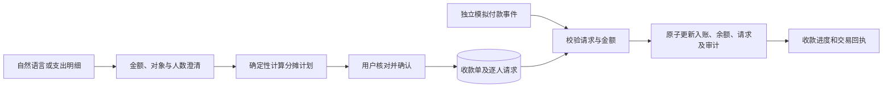

# 智能 AA 分账与收款追踪：实现范围与验收计划

规划及实现日期：2026-10-03。状态：首版已实现。本文保留原始场景，并按现有代码更新实现边界与核验入口。

## 1. 项目定位

定位为“我垫付后的 AA 收款助手”。用户用一句话描述垫付金额与参与者，或从账单明细发起；系统澄清对象、人数与承担方式，计算到分的分摊计划，确认后建立模拟收款单，再追踪每个人的回款。

实现复用了联系人、自然语言入口、确认交互、账本和审计，补齐原参赛规划中的 AA 收款，将账单与资金操作串成完整场景。预约转账继续独立使用，AA 模拟回款使用共享业务时钟。

## 2. 主演示场景

> “聚餐我垫了 368.50 元，我、林悦、王明、陈晨四个人 AA，帮我生成收款单。”

1. **理解**：提取人民币总额、当前用户垫付、四位参与者、均分规则及用途。
2. **澄清**：王明有同名联系人时，让用户按脱敏手机号选择；明确展示“共 4 人，包含我”。如果原句无法确定是否包含自己，先问清楚。
3. **计算并预览**：按稳定的参与者顺序分配不足一分的余数。示例为本人 92.13 元、林悦 92.13 元、王明 92.12 元、陈晨 92.12 元，总额严格为 368.50 元。
4. **确认建单**：显示本人承担 92.13 元、向其他三人应收 276.37 元。用户确认后保存收款单；此刻余额不变。
5. **追踪回款**：每人分别显示待支付或已到账。演示控制中模拟林悦付清 92.13 元后，收款单显示“部分收齐”，余额增加 92.13 元，产生唯一入账交易。
6. **逐笔核验**：点开回款可看到付款人、到账金额、业务时间、收款请求和交易编号。

不把“生成收款单”表述为“已收到钱”或“已通知对方”。首版请求保存在本地模拟环境，不向联系人发送消息，也不扣取对方账户。

## 3. 已实现的首版范围

| 功能 | 首版行为 |
| --- | --- |
| 一句话发起 | 提取金额、用途、参与者和均分意图；不确定字段先澄清 |
| 从账单发起 | 在已完成的支出明细增加“AA 分摊”；总额、日期、来源 ID 从服务端原交易读取，不能被模型改写 |
| 手动自述垫付 | 可输入账本外已垫付金额，标记“用户填写，未关联银行支出”；不自动补记一笔支出 |
| 人数与对象 | 首版 2–8 人，当前用户为唯一垫付者并参与分摊；联系人按稳定 ID 去重，同名必须选择 |
| 分摊规则 | 默认均分；支持明确录入非负整数比例或逐人手动金额；服务端按整数分和最大余数法核算比例，所有份额之和须等于垫付总额；0 元份额显示“无需付款”，不创建 0 元收款请求 |
| 不明确的优惠 | “王明少付 20 元”等指令先澄清由谁承担差额，不自行转嫁给其他人 |
| 收款单 | 本人份额、他人应收、已收和未收分开展示；支持刷新恢复和明细查看 |
| 模拟回款 | 每位付款人一次付清其份额；独立演示入口生成幂等到账事件，原子更新余额、交易及收款状态 |
| 关闭收款 | 对未收齐单据显示影响并确认关闭；停止剩余收款请求，已到账款项不退回，已收记录永久保留在当前演示数据中 |

首版范围后续已补充：未结收款单在确认时列明三天后的演示日期，到期由共享业务时钟创建一次可追踪站内提醒；提醒仅提示打开 AA 查看实时余额，不发送联系人消息。比例份额也已实现，但比例须由用户明确录入，不从自然语言推断。分次回款已实现；已付清请求的单笔回款退款支持独立授权、可退额核对与模拟账本支出，退款后原请求仍保持已付清。多人垫付净额计划可确认保存；经过本人账户的每条结算路径逐笔授权、重查余额/预留和日累计额度，并写模拟账本回执。按菜品分摊支持手工录入或本机 RapidOCR 识别候选菜品；图片发至本机进程并在内存处理，不传云端、不落盘，参与人和垫付总额不自动填写，OCR 结果须人工逐项确认。服务端逐项分币并在确认时重算快照。其他成员间的路径仅保留建议，不能在本地代转或标为已付。仍暂缓：真实付款链接、真实消息及外部自动催收；也不支持收款单重分摊或替换。

## 4. 页面设计

- **智能转账页**增加紧凑的“转账 / AA 收款”切换，两个操作区分别展示当前任务，避免把所有列表堆在同一屏。
- **AA 创建区**保留一句话输入及小型分摊表。预览列出参与人、本人标识、份额和余数说明；合计不一致时显示差额，禁用确认。
- **收款单列表**显示用途、来源、已收/应收、到账人数和状态；点开沿用现有明细弹窗。
- **模拟付款**放入折叠的演示控制，明确标注“模拟某位参与者付款”，不让一般建单操作看起来能代扣他人资金。
- 延续深蓝底色、蓝色操作按钮、金色授权确认；不增加宣传横幅或静态说明大卡片。

## 5. 数据与授权设计

### 金额不变量

全部使用整数分，禁止模型计算最终金额：

- `垫付总额 = 本人承担额 + 其他参与者份额之和`。
- `应收 = 其他参与者份额之和`；本人不向自己产生收款请求。
- `已收 = 成功到账事件金额之和`，每个请求最多成功一次且到账金额等于其应付份额。
- `未收 = 应收 - 已收`，不能为负；单据关闭后仍显示“尚未收回 X 元”，不能冒充收齐。
- 建单时不改变余额；引用原支出不再次扣款；自述垫付不补写银行支出。
- 均分采用商和余数：余数按预览中确定并保存的顺序逐人加 1 分。显示谁多承担了 0.01 元，不随刷新或模型输出顺序变化。

### 持久化与状态

新增 `aa_collections`、`aa_requests`、`aa_payment_events`。收款单保存账户归属、会话、来源交易 ID（可空）、来源类型、授权快照、总额、本人份额、稳定联系人 ID、逐人份额及用途；逐人请求关联到账事件与交易编号。解析过程中的补参状态保存在会话上下文中。

- 草稿沿用现有短时确认边界，确认后形成持久化单据；重复确认返回原单据。
- 单据状态：待收款、部分收齐、已收齐、已关闭。逐人请求为待付款、已到账或已关闭；零份额为无需付款。
- 确认后金额和成员不允许原地修改。全部未到账时可关闭后重新建单；已有回款的单据首版不支持重分摊或替换。
- 同一笔银行支出已有有效/已收齐分摊单时，提示查看原单，阻止重复建单；关闭且从未回款的单据可以重新发起。对自述垫付只保证重复确认幂等，不声称能识别所有重复垫付。
- 关闭与到账采用同一事务边界：关闭先完成则拒绝新模拟付款；到账先完成则保留真实已收金额，关闭剩余请求。已收齐单据无需再关闭。
- 到账事件、逐人请求有唯一键；重复点击或响应丢失重试不会产生第二笔入账。接入真实支付方时，需要另行实现受认证的回调、付款结果查询和对账。
- 确认建单时重新读取原交易并校验参与人指纹、总额与份额。模拟到账时再次比对原确认操作与单据授权快照，拒绝不匹配的请求；余额、交易、事件、请求状态、单据状态和审计在一个写事务中提交，失败一起回滚。

### 与现有账本的关系

到账产生 `direction='in'` 的模拟交易，关联原收款请求和分摊单；账户概览显示收入。回款明细在 AA 单据中可查。现有账单报告统计的是支出，回款不能从原消费金额中直接减去；AA 明细可另展示“当前净垫付 = 原垫付 - 已回款”，但不能冒充净消费统计。

AA 创建请求不消耗即时转账的每日支出额度。模拟付款控制使用既有演示开关并绑定当前会话和指定请求，不能接受任意账户 ID 或任意到账金额。时间采用当前共享业务时钟，授权时间保留真实 UTC。

## 6. 实现拆分与核验入口

以下功能已落地。原规划估算为 10–14 小时，不作为实际耗时或验证结果；最终测试和页面试用结果以当次执行记录为准。

| 模块 | 已实现行为 | 核验重点 | 主要代码 |
| --- | --- | --- | --- |
| 分摊预览 | 引用或填写总额、整数均分及余数、逐人改额 | 合计守恒、零份额、预览不改账本 | `backend/app/aa.py`、`frontend/src/AaPanel.tsx` |
| 语言补参 | 姓名/手机号、是否包含本人、人数、垫付者、备注隔离、非均分提醒 | 重名/未知联系人、付款者不等于承担者、多个金额 | `backend/app/aa_intent.py`、`agent.py`、`aa.py` |
| 授权建单 | 黄级确认、原交易校验、持久化授权快照、重复确认幂等 | 会话归属、凭证过期、来源防重复、余额不变 | `backend/app/aa.py`、`service.py`、`db.py` |
| 列表与明细 | 当前会话单据、逐人状态、来源和回执 | 刷新恢复、跨会话隔离、应收/未收口径 | `backend/app/main.py`、`aa.py`、`frontend/src/AaPanel.tsx` |
| 模拟回款 | 已授权请求按确定份额入账，关联唯一交易和事件 | 重放、并发、故障回滚、演示开关 | `backend/app/aa.py`、`backend/tests/test_aa.py` |
| 关闭请求 | 终止尚未付款请求，保留已收记录 | 关闭/付款竞争、未收金额、来源释放条件 | `backend/app/aa.py`、`frontend/src/AaPanel.tsx` |
| 多人结算计划 | 版本化预览确认保存；本人相关路径逐笔授权和模拟入/出账；其他人路径保留线下建议 | 跨会话隔离、联系人变化、预留保护、日累计超阈强验证、幂等与失败回滚 | `backend/app/aa_settlement.py`、`backend/tests/test_aa_settlement.py`、`frontend/src/AaSettlementPanel.tsx` |
| 按菜品分摊 | 人工录入菜品、金额与参与人；服务端按分均分并将菜品明细保留在授权和收款回执中 | 明细合计、重复/未知参与人、余分顺序、确认快照 | `backend/app/aa.py`、`backend/tests/test_aa.py`、`frontend/src/AaEditor.tsx`、`AaAllocation.tsx` |
| 场景入口 | 智能转账页 AA 切换、账单明细发起、对话识别 | 传入原支出、确认内容、明细操作 | `frontend/src/App.tsx`、`AaPanel.tsx` |

接口链路：收款请求为 `/api/aa/interpret` → `/api/aa/preview` → `/api/aa/prepare` → `/api/actions/{action_id}/confirm` → `/api/aa/collections`。多人垫付为 `/api/aa/settlements/preview` → `/api/aa/settlements/prepare` → 用户确认保存 → `/api/aa/settlements` 查询；本人相关路径经 `/api/aa/settlements/{settlement_id}/legs/{leg_id}/prepare` 单独授权，再由通用确认端点执行。回款与关闭分别使用 `/api/aa/requests/{request_id}/simulate-payment` 和 `/api/aa/collections/{collection_id}/close`；接口字段说明见《技术与安全说明》。

**检查点 A：** 查看 100 元三人均分及同名消歧，确认“本人是否参与”和每人金额清晰。

**检查点 B：** 建单、刷新、重新读取后仍是一张单，账户余额没有变化。

**检查点 C：** 部分回款、全部收齐、关闭未付和重复事件均以模拟账本为核验依据，再进行用户试用。

## 7. 关键验收情境

1. 100 元由本人、林悦和陈晨均分，显示 33.34 / 33.33 / 33.33 元；应收为 66.66 元，不能向本人收款。
2. “和两位朋友 AA”未明确人数口径，或存在两位王明时，先澄清，不创建可收款请求。
3. 从一笔已存在的 300 元支出发起，建单不改变余额及支出报告；林悦回款后只新增一笔收入，原支出仍是 300 元。
4. 同一请求连续付款、两个并发付款事件及服务重启后重放，只增加一次余额；用户自定义回调金额或请求归属会被拒绝。
5. 部分到账后关闭：已收记录保留，未收金额明确标识为停止收取，后续模拟付款被拒绝。
6. 均分总额不足以让所有人分到一分时，零份额标为无需付款；不创建零元请求，不把它算作等待到账。
7. 原交易重复分摊、跨会话确认/关闭、备注中夹带指令、修改已确认份额、数据库中途失败均不会产生额外资金变动。

## 8. 60 秒演示脚本

输入聚餐垫付指令 → 澄清王明是哪一位 → 展示准确到分的分摊表 → 确认建立收款单并证明余额不变 → 模拟一位参与者付款 → 展示部分收齐、余额变化与入账编号 → 重复触发同一付款，展示同一个结果。

首版不依赖第三方支付服务、IM 服务或新增付费依赖。DeepSeek 仅参与受限语言理解；AA 关键词分支用原文规则约束金额与参与者，并按实际采用结果标记“规则”。分摊、确认、入账和状态转换由服务端确定性代码执行。

## 9. 未覆盖范围与演示边界

- 多人垫付后的净额计算、保存计划和本人相关逐笔模拟结算已实现；其他参与者之间的路径只作为线下建议。按菜品人工分摊和本机 OCR 草稿识别已实现；OCR 不识别参与者，也不自动提交；自动比例/权重分摊尚未实现；自定义份额由用户在确认前逐人填写。
- 分次回款和已付清回款的单笔退款已实现；尚不支持已回款收款单重分摊或替换。
- 首版仅允许本人作为垫付者并包含在分摊名单中，不能代他人垫付建单；本人免付可明确设置 0 元。
- 付款入口仅产生本地模拟收入，不访问付款人账户、不发真实消息、不生成支付链接，也没有自动催收。
- 当前会话 ID 不是正式身份认证，清除浏览器本地存储会失去原会话单据入口；真实支付的回调认证、对账与外部幂等尚需另行设计。
- 自述垫付没有银行原交易作为去重依据；仅对同一授权重复确认及同一付款请求重放保证幂等。
