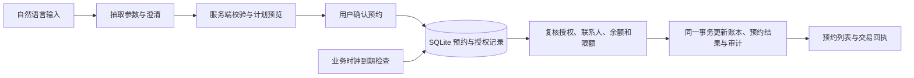

# 下一阶段：智能预约转账

规划日期：2026-10-03。首版已于同日实现并验证；下文保留原规划。实际能力和限制以 [技术与安全说明](技术与安全说明.md) 与 [README](../README.md) 为准。

## 1. 定位与优先级

将现有“一句话转账”扩展为“理解未来时间 → 补齐信息 → 确认预约 → 到期检查并执行 → 查看回执”。这是 VeraLane 下一项建议优先开发的智能能力，可直接复用联系人消歧、金额校验、操作确认、模拟账本和审计，并为后续生日任务提供持久化任务能力。

本轮聚焦单次预约。循环转账、AA 收款、资金预留、自动重试与跨场景组合放入后续迭代。预约不会提前扣款或冻结余额。

## 2. 用户体验

**示例指令：**“10 月 6 日晚上 8 点给林悦转 300 元，备注房租。”

1. **理解与澄清**：识别收款人、金额、备注和时间；同名联系人需选择，缺少金额或具体时间需补齐。“月底”“有钱时”等不明确条件不直接生成可执行预约。
2. **展示计划**：展示收款人及手机号尾号、300.00 元、房租、完整执行日期与北京时间，以及本次解析来自 AI 还是本地规则。模型输出的日期仍由服务端校验。
3. **明确授权**：按钮为“确认预约”，并说明“到期通过检查后自动执行，无需再次点击确认；不会提前冻结资金”。未确认的草稿不进入调度。
4. **管理预约**：转账页增加紧凑的“我的预约”列表，显示时间、对象、金额与状态；点开小窗口查看明细、授权记录和执行结果。待执行预约可以取消。
5. **查看结果**：到期成功后展示实际执行时间、交易编号及账单入口；失败或失效时显示原因和“重新预约”。重新预约必须重新确认。

界面沿用深蓝配色、现有确认交互和明细弹窗；不增加大幅宣传区。列表默认突出待执行任务，历史记录可折叠，保留主要操作空间。

## 3. 首版范围与规则

| 项目 | 拟定行为 |
| --- | --- |
| 时间输入 | 支持明确日期时间、今天/明天/后天与常见上下午表达；只有日期时询问具体时间；时间已过时要求修改 |
| 时区与日期基准 | 北京时间 Asia/Shanghai；“明天”等相对时间依据页面显示的演示时钟，不依据用户电脑日期 |
| 执行方式 | 确认后保存单次预约；后端运行且业务时钟到期时，自动进行确定性检查与模拟转账 |
| 执行窗口 | 建议为预约时间起 10 分钟内；服务恢复或演示时钟推进后若已超过窗口，标记失效，不补扣；确认卡明示这条规则 |
| 金额与限额 | 沿用原型的日累计 1,000 元黄级上限；单笔超过上限不建立可执行预约；余额和当日累计以实际执行时为准 |
| 多笔预约 | 可展示同日待执行总额作为提醒；预约不占用余额或保证未来额度，同日多笔执行串行复核限额 |
| 修改与取消 | 首版取消后重新预约；取消与执行竞争时，服务端返回真实最终状态，已执行交易不能显示为取消成功 |
| 异常处理 | 余额不足、联系人失效、限额不足时失败并停止；没有自动业务重试 |
| 通知 | 站内状态与回执；关闭网页后，后端仍运行即可处理到期任务；关闭后端期间不会执行 |
| 演示控制 | 开发/演示入口“推进到下一预约时间”；推进的是持久化模拟时钟，不修改电脑系统时间；空任务时禁用 |

**授权区别：**“确认预约”的草稿保留现有 10 分钟确认有效期，按服务器实际时间计算；确认后单独保存长期预约授权，绑定账户、联系人 ID、金额、备注、执行时间和窗口。调度器不能把过期草稿当成已授权预约，也不能由模型临时改写已确认的参数。

## 4. 实现设计

- **共用业务时钟**：当前固定为 2026-09-30 的演示日期需统一封装；即时转账的每日限额、账本日期、账单期间、订阅提醒与预约调度使用同一业务时间来源。短时确认凭证的真实到期时间独立处理。
- **持久化预约**：新增预约记录，至少包含任务 ID、账户归属、授权来源、联系人 ID、金额（整数分）、备注、执行时间、窗口截止时间、状态、结果/失败原因、关联交易 ID。确认后刷新页面、重启服务不丢失。
- **可追踪状态**：待确认属于草稿；任务状态为待执行、成功、失败、已取消、已失效。首版模拟银行在一个短事务内完成到期检查与写账，无须长期停留在“执行中”。
- **单次账本效果**：同一预约的唯一执行键、数据库唯一约束与事务共同约束；扣款、交易、成功状态及审计原子提交。重复到期检查、并发检查或提交后响应丢失，都不能产生第二笔扣款。
- **有限调度范围**：首版为本地单实例后端检查到期任务，不引入外部队列或云服务。以后接入外部银行时，需要另行设计外部请求幂等、结果查询及对账，不能沿用本地事务假设。
- **控制模型成本**：复用现有 DeepSeek/本地规则入口；模型用于理解表达，到期检查与执行不调用模型。规则模式也应能完整复现主演示。

## 5. 开发任务与检查点

目标安排：10 月 4–9 日完成首版，预留至 10 月 11 日处理集成问题。估算约 8–12 小时的集中开发与验证，需按实际推进修正；用户重点参与两次体验检查和最终试用。原排期同阶段的 AA 收款顺延，避免同时展开两条新流程。

下表文件为预计触及范围，实施前核对实际模块边界；新增文件标注“新增”。每项控制在一次约 1–2 小时的工作段内。

| 任务 | 交付与验收标准（每项最多三条） | 验证方式 | 依赖 | 预计文件与规模 |
| --- | --- | --- | --- | --- |
| T1 统一演示时间 | ①业务日期来源一致；②页面可见完整演示时间与时区；③短时确认过期不随演示跳时延长 | 日期跨天回归用例；页面核对 | 无 | 新增 `backend/app/clock.py`；`service.py`、`main.py`、`frontend/src/App.tsx`、新增时钟测试；M |
| T2 生成预约草稿 | ①明确时间可形成预览；②缺参、重名或无效时间先澄清；③预览显示完整时间与解析来源，不扣款 | API 参数用例；浏览器两轮补参 | T1 | `backend/app/agent.py`、`service.py`、`frontend/src/App.tsx`、`App.css`、新增预约测试；M |
| T3 确认并保存预约 | ①只有明确确认才创建任务；②重复确认仅创建一项；③刷新后可在列表和弹窗查看授权参数 | 重复确认/跨会话用例；刷新复查 | T2 | `backend/app/db.py`、`service.py`、`main.py`、`frontend/src/App.tsx`、预约测试；M |
| T4 到期执行 | ①提前不执行，到期复核条件；②扣款、账单、任务结果一致且不重复；③重启后依据执行窗口处理 | 并发触发、重启与事务失败测试；演示时钟推进 | T3 | 新增 `backend/app/scheduler.py`；`service.py`、`main.py`、预约测试；M |
| T5 取消预约 | ①待执行预约可以取消；②重复取消可安全返回；③取消与执行竞争时结果与账本一致 | 取消竞态用例；页面确认及结果核对 | T4 | `backend/app/service.py`、`main.py`、`frontend/src/App.tsx`、预约测试；M |
| T6 演示与交付说明 | ①成功、失败回执可读且有交易来源；②演示时间推进入口可重复使用；③技术说明及演示步骤与实现一致 | 全流程试用；后端回归、前端 lint/build | T5 | `frontend/src/App.tsx`、`App.css`、`README.md`、`docs/技术与安全说明.md`；M |

**检查点 A（T1–T2）：** 用户核对时间展示、补参流程与确认文案；原即时转账、账单和订阅流程继续可用。

**检查点 B（T3–T4）：** 未确认不调度，已确认可恢复，重复触发不重复扣款；数据库结果与页面一致。

**检查点 C（T5–T6）：** 用户完整试用；验收情境通过，失败原因与演示限制已写入文档，适合加入比赛录屏。

## 6. 必须通过的验收情境

1. **正常预约**：给林悦预约 300 元；提前一秒不扣款，到期只出现一笔交易，任务回执和账单对应同一个交易 ID。
2. **歧义补参**：“明天转给王明”必须补齐金额、具体时间和联系人；确认卡展示明确日期和手机号尾号。
3. **条件变化**：建立预约后余额减少，或即时转账占用当日额度；到期准确显示余额不足/限额不足，账本无部分更新。
4. **取消竞争**：取消成功的预约永不执行；若执行先完成，取消操作返回已执行结果，不宣称资金退回。
5. **重复与恢复**：重复点击确认、重复调度、并发调度及写入后重启，均只有一项预约和最多一笔关联转账。
6. **错过窗口**：窗口内恢复服务可继续检查；窗口后恢复标为失效，需重新预约；演示时钟大步前进也遵循相同规则。
7. **越权与改参**：其他会话不能确认或取消不属于自己的任务；确认后替换联系人、金额或时间不能改变授权内容。此处沿用原型会话绑定，并不代表实现了正式身份认证。

## 7. 约 60 秒演示脚本

- 输入明确日期的预约指令，展示提取出的对象、金额和时间。
- 点击确认预约，展示待执行记录及“尚未扣款”。
- 用演示控制推进到预约时间，展示成功回执，并打开对应账单明细。
- 复查或再次触发检查，展示同一交易编号，证明没有重复扣款。

第二段可选演示：提前取消一笔预约，或用余额不足情境展示拦截及原因。

## 8. 后续扩展顺序

预约首版稳定后，再评估“周期性预约”或“生日资金预留与提醒”。前者需要定义每次扣款的授权边界与节假日规则，后者需要独立的资金预留账本；两者均不直接扩大本次预约授权。
