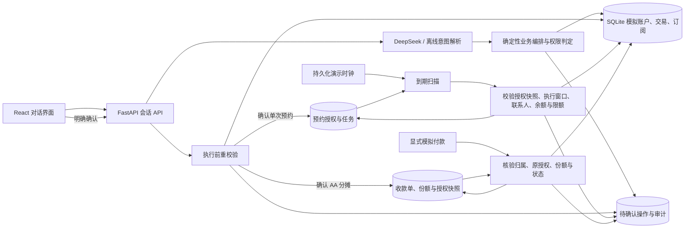

# VeraLane 技术与安全说明（原型阶段）

更新时间：2026-10-03。本文描述仓库中**已经实现**的系统；待开发能力单列于末尾。

## 系统架构

浏览器通过本地 Vite 代理请求 FastAPI。四个工作区使用可直接打开的 hash 地址；对话页和转账页的自然语言入口使用受限意图解析，业务页通过专用 API 读取数据或准备操作。DeepSeek 只返回结构化意图和参数，不能直接执行 SQL 或调用写工具。未配置密钥或模型调用失败时，使用有限的本地规则解析，并在界面标记解析来源。对话与业务页共用相同的服务端权限检查和确认执行器。

## 核心算法与数据流

1. **意图提取**：输入最多 500 字，解析为受限枚举 `balance_query / bill_summary / transfer / aa_split / subscription_list / subscription_cancel / unknown`，附可选收款人、金额、备注、期间、订阅名称或 AA 参与者等字段。模型输出由 Pydantic 再校验；无法解析时不产生写操作。带 AA 关键词的输入采用原文规则提取金额和人数等约束并标记为“规则”，即使调用过模型也不会把被规则覆盖的结果标为 AI；模型用量仍据实记录。
2. **对象消歧**：转账只匹配数据库中 `verified=1` 的联系人。重名时返回候选人 ID 与脱敏手机号；用户可在转账页点选候选人，服务端把选择限制在当前会话待处理的同名集合，也可补充完整号码。金额缺失则保留会话上下文，下一轮补齐。
3. **金额与权限**：使用 Decimal 把元转换为整数分；金额须大于零、最多两位小数。依据实际执行的演示日期，当日已执行转账与本笔金额之和不超过 1000 元为黄级；超过为红级。即时转账创建计划时检查余额。预约只接受单笔不超过 1000 元的可执行授权，不冻结余额或保证未来额度；到期再次检查联系人身份指纹、余额与累计额度。
4. **确认与幂等**：黄级写操作生成 10 分钟有效的随机操作 ID，界面展示具体对象和影响。确认 API 在 `BEGIN IMMEDIATE` 事务中检查会话、状态、有效期和权限，随后更新账本或协议状态及审计。完成后重复确认返回原结果，不重复扣款。红级计划直接拒绝确认，等待尚未实现的强验证能力。
5. **账单统计与呈现**：只统计指定期间 `direction='out'` 的账本交易，以整数分按分类求和，报告列出交易 ID、日期、分类、金额与备注。界面提供分类条形图、占比环图、交易日趋势图及逐笔明细弹窗。高金额提示阈值为 `max(500 元, 本期金额中位数 × 3)`，超过阈值的交易标为“建议复核”，不声称存在欺诈。
6. **账单导出**：CSV 与 JSON 由服务端按当前期间重新查询并生成下载文件；CSV 为中文表格加入 UTF-8 BOM，并转义可能被电子表格解释为公式的文本。PDF 使用浏览器打印功能及专用打印样式，由用户在打印窗口选择保存为 PDF。
7. **订阅识别、提醒与取消**：数字服务分类下，同一商户在演示日期的本月及上月均有扣费时，标记为周期扣费候选，并列出证据交易 ID。已保存的有效协议若在未来 30 天内续费，则展示提醒。取消仅能作用于已保存且仍有效的模拟协议；确认时再次验证协议状态，避免重复取消。
8. **单次预约**：意图仍为 `transfer`，可附 `schedule_requested`。服务端只从原始指令的非备注部分解析支持的日期和时分，绝不执行模型自由生成的时间；模糊、无效、多个时间先澄清。金额、联系人和时间槽可逐轮补齐，确认卡显示完整日期及北京时间。
9. **到期调度**：确认 `scheduled_transfer` 操作时，仅保存绑定账户、联系人身份指纹、金额、备注和执行窗口的授权任务。短时凭证按真实 UTC 过期，长期任务按持久化演示时钟运行。FastAPI 后台每 2 秒扫描，到期任务在 `BEGIN IMMEDIATE` 事务中核对原授权及时间索引列，再原子更新账户、交易、任务状态和审计；交易的唯一 `action_id` 约束防止重复写账。确定性失败和超时不自动重试，未提交的数据库事务在故障后可安全重新扫描。
10. **取消与恢复**：任务状态为 `pending / completed / failed / cancelled / expired`；取消与执行使用同一数据库写锁，返回实际获胜结果。已完成任务重复扫描不会再扣款。窗口为 `[execute_at, execute_at + 10分钟)`，停机恢复或模拟时间跳过窗口后标为失效。修改需取消后重新生成并确认。
11. **AA 意图与金额计算**：从原始指令的非备注部分提取垫付总额、原始参与人姓名/手机号、是否含本人、声明人数、垫付者和非均分标记。未知联系人不能被默默丢弃；同名返回候选 ID 和脱敏手机号，补充完整号码可消歧。“我垫付”不等于“我参与分摊”；首版用于本人唯一垫付、本人及 1–7 位已验证联系人分摊，人数和不支持的承担方式须先核对。总额须大于零、不超过 100000 元且精确到分。均分使用 `divmod(总分, 人数)`，按本人在前及预览联系人顺序给前若干人各加 1 分；手动份额须完整、非负且总和等于总额。零份额不创建付款请求。
12. **AA 来源与授权**：从账单发起时，服务端读取本账户 `direction='out'` 的原交易并锁定总额、日期、商户与编号；自述垫付标记 `source_type='user'`，不补写支出。预览只计算；准备操作生成黄级 `aa_collection`，明确确认后建立持久化收款单及逐人请求，余额不变。确认重新核对参与人指纹、金额、来源和重复分摊约束，已确认单据与原操作保存同一授权快照。相同确认重试返回原单。已有关联分摊单的原支出不可再次发起；只有完全未回款且已关闭的单据才释放来源，避免对同一支出重复收款。
13. **AA 模拟到账与原子性**：独立模拟接口只接受请求 ID 与会话 ID，不接受调用方指定的到账金额或账户。检查演示开关、会话归属、原黄级授权、快照、参与人指纹、份额及未关闭状态后，在 `BEGIN IMMEDIATE` 事务中同时增加余额、写入唯一 `direction='in'` 的 `AA回款` 交易和付款事件、更新请求/单据状态及审计。请求、事件和交易关联键防止重放产生第二笔收入；失败回滚全部变更。单据状态为 `pending / partial / completed / closed`；本人及零份额不等待付款。
14. **AA 关闭与账本口径**：关闭与模拟到账使用同一写事务边界。关闭只终止未付款请求，保留已经到账的金额、时间与交易编号，不退款。尚未收回金额继续展示，不能冒充已收齐。到账使用共享演示时钟；建单授权按实际 UTC 计时。AA 收入不冲减既有支出报告；单据可单独显示 `当前净垫付 = 原垫付 - 已回款`。收款单不触发真实支付或消息发送，也不消耗转账日支出额度。

### AA 专用 API

所有接口均基于本地虚构账户；创建、查询、关闭和模拟付款绑定 `session_id`。AA 专用 POST 接口拒绝请求体中的额外字段。

| 方法与路径 | 用途 |
| --- | --- |
| `POST /api/aa/interpret` | 解析或补齐草稿；接收 `message`，可指定 `source_transaction_id`，`reset=true` 开始新草稿；返回 `aa_draft` 与待核对项 |
| `POST /api/aa/preview` | 按总额、联系人 ID、是否含本人及可选逐人份额计算预览，不创建收款单 |
| `POST /api/aa/prepare` | 重新校验预览参数，生成待确认的 `aa_collection` 操作 |
| `POST /api/actions/{action_id}/confirm` | 复用确认执行器，在有效授权下建立收款单 |
| `GET /api/aa/collections` | 查询当前会话收款单及演示控制状态 |
| `GET /api/aa/collections/{collection_id}` | 查询份额、已收/未收、来源及逐人回执 |
| `POST /api/aa/collections/{collection_id}/close` | 关闭剩余未付请求，保留已到账记录 |
| `POST /api/aa/requests/{request_id}/simulate-payment` | 在演示控制开启时，模拟指定参与者一次付清已授权份额 |

AA 数据保存在 `aa_collections`、`aa_requests`、`aa_payment_events`，并复用 `actions`、`transactions`、`accounts` 与 `audit`。浏览器本地会话丢失后尚无正式登录恢复机制；事务与幂等保证仅覆盖当前 SQLite 模拟环境。

## 权限分级实现说明

| 等级 | 规则 | 当前处理 |
| --- | --- | --- |
| 绿 | 余额、账单、订阅查询及 AA 预览/单据读取 | 直接读取或计算，不生成资金变动 |
| 黄 | 日累计不超过 1000 元的转账、单次预约授权、取消代扣、AA 建单授权 | 展示操作摘要，等待明确确认；预约到期凭已保存授权执行，重新核验实际当日累计；AA 建单只保存应收请求 |
| 红 | 日累计超过 1000 元的转账 | 显示强验证要求；当前原型禁止执行 |

后续的卡片挂失、理财申购等场景在实现时应划为红级并增加独立强验证。当前没有身份系统，因此本原型只适合本地虚构数据演示。

## 安全自评与已知风险

| 风险 | 现有控制 | 未完成项 |
| --- | --- | --- |
| 模型误解或提示注入导致误操作 | 模型只输出受限意图；联系人、金额、权限、余额由服务端校验；写操作需确认 | 建立对抗样例集，测试备注、商户文本中的指令注入 |
| 未授权操作 | 黄级确认与红级拦截；确认绑定会话 ID | 会话 ID 不是正式身份认证；需要真实登录、设备绑定及强验证后才能接真实业务 |
| 重复执行或竞态 | 即时及预约转账使用事务、唯一 action ID、授权快照比对、执行时重校验；取消与执行竞争测试通过 | 外部银行请求和多账户场景需要独立的幂等、对账与补偿设计，本地事务不保证外部系统恰好执行一次 |
| AA 重复收款或金额偏移 | 整数分合计校验、授权快照、来源防重复、唯一付款事件、事务回滚及关闭/入账串行化；客户端不能自定到账金额 | 自述垫付无法识别所有重复事项；尚无真实付款方认证、支付回调、退款与对账服务 |
| 时间混淆和未来授权 | 完整北京时间、明确执行窗口，预约独立于短时确认凭证；预约参数变化或超时不放行 | 当前演示时钟需手动推进，不是现实时间任务服务；模型识别误差仍需用户核对 |
| 演示管理入口 | 时间推进与 AA 模拟付款的页面/接口由 `VERALANE_DEMO_CONTROLS` 控制；模拟付款还校验当前会话归属 | 仅面向本地虚构数据；会话 ID 不是正式管理员或付款人认证，不应对外部署该控制接口 |
| 个人信息泄露 | 本地使用虚构数据；界面显示脱敏手机号；密钥在被忽略的 `.env` 中 | 配置 DeepSeek 时，原始用户消息会送往模型服务；真实场景需要数据最小化、授权与合规审查 |
| 数据损坏或丢失 | SQLite 事务；本地审计表 | 暂无备份、迁移、数据保留策略；审计未做到防篡改 |
| 金融结果误导 | 页面明确标记模拟；报告使用账本数据和交易 ID；异常仅提示复核 | 数据集小、规则粗糙，不能用作真实反欺诈或理财建议 |
| 资源滥用 | 输入长度限制、模型超时、有限输出 token | 尚未加入用户限流、预算熔断和模型调用成本面板 |

## 当前与计划范围

当前支持即时与单次预约转账，以及本人垫付后的 AA 分账、确认建单、模拟回款、回执与关闭；使用可推进的模拟时钟。AA 首版未实现多人垫付抵消、按菜品/OCR 拆账、自动比例计算、单人分期、退款、付款链接、消息发送及催收。订阅候选仍仅依据两个月的虚构交易，协议仍为预设数据，异常提示为单条透明规则。周期预约、更稳健的订阅识别、卡片、理财、跨场景联动、强验证、完整比赛评测集和最终答辩材料仍需逐阶段完成。会话 ID 不是正式身份认证，清除浏览器本地存储不会撤销已授权预约，也会失去原会话 AA 单据的操作入口。
