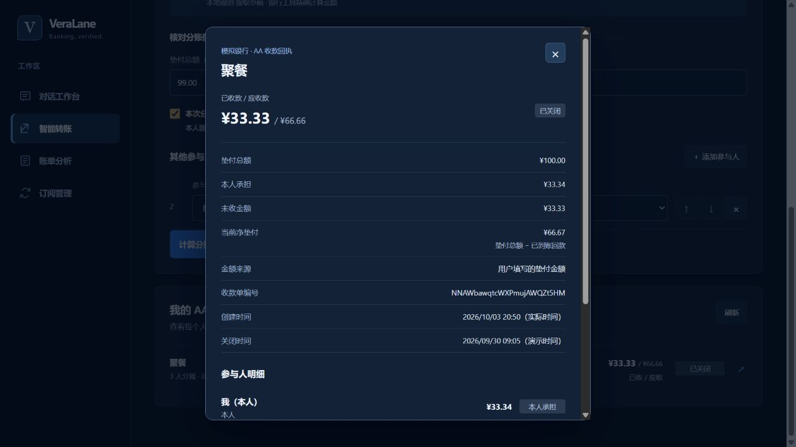

# 智能 AA 分账与收款追踪：验收记录

验收日期：2026-10-03。环境：本地 FastAPI / SQLite、Vite、虚构银行账户。

本文是首版 AA 的历史验收快照；之后加入的退款、多人结算和人工按菜品分摊以《全阶段执行记录》和当前技术文档为准。

## 自动化检查

- 后端全量：`205 passed`。包含 54 项 AA 业务/API 测试和 35 项 AA 意图解析测试。
- 前端：`npm run lint`、`npm run build` 均通过。
- 测试覆盖：整数分合计与余数、零元份额、授权过期与会话隔离、原支出绑定和防重复、重复/并发入账、失败事务回滚、关闭与付款竞态、数据库恢复、多轮补充、同名联系人消歧、备注隔离，以及授权快照和请求金额被修改时拒绝入账。
- 后端存在一条既有 Starlette/httpx 弃用提示，不影响本轮测试通过。

## 浏览器实测

1. 在“智能转账 → AA 收款”输入“我垫了100元，我和林悦、陈晨三人AA，备注聚餐”。正确提取总额、两位联系人、本人参与和垫付者身份。
2. 计算得到本人 33.34 元、林悦 33.33 元、陈晨 33.33 元，均分余数在预览中说明。
3. 生成确认单后，必须单独勾选核对声明才能建单。建单前后模拟余额均为 8487.30 元，已收金额为 0。
4. 在明细中显式模拟林悦付款 33.33 元：单据变为“部分收齐”，模拟余额增加到 8520.63 元，出现到账时间及唯一交易编号。已付款项不再提供付款按钮。
5. 二次确认关闭剩余请求：陈晨的请求关闭，林悦的回款保留；单据显示“已关闭”“未收金额 33.33 元”，净垫付为 66.67 元。
6. 刷新并重新打开 AA 列表，已关闭单据和回款记录仍存在。
7. 从账单中打开城市咖啡 45.90 元交易明细，再点击“用这笔支出发起 AA 分摊”：进入 AA 页面，显示原交易编号、日期和金额；总额不可直接修改。
8. 对话工作台输入“我垫了99元，我和林悦AA”，出现“核对 AA 分摊草稿”按钮；点击后真正跳转到 AA 表单并带入金额和名单。
9. 四人 368.50 元示例另经浏览器验证：同名王明须选择手机号，分摊为 92.13 / 92.13 / 92.12 / 92.12 元，确认后打开明细，未模拟回款。
10. 320 px、768 px 视口下检查 AA 页面和明细；文档及明细无横向内容溢出。恢复默认视口；本次浏览器检查未发现控制台错误或警告。

## 演示数据与边界

浏览器验收保留了一张 100 元、已收 33.33 元后关闭的演示单，以及另一浏览器会话中一张 368.50 元未回款单。它们都是虚构数据；测试未访问真实联系人账户、发送真实消息或执行真实付款。

这轮浏览器演示使用本地规则解析。DeepSeek 返回结构的处理和来源标识通过 mock 测试验证，未据此宣称真实模型 API 已完成端到端验收。

**2026-10-03 首版验收时的范围：**本人须是唯一垫付者，每位参与者一次付清。自述垫付不补写消费，AA 回款单独计为收入，不冲减原支出报告。当时尚未实现多人垫付抵消、退款、真实支付回调和付款方认证。后续进展见下方更新记录；历史浏览器步骤与截图仍只证明首版行为。

## 后续实现更新（截至 2026-10-04）

首版之后已补充：多人垫付净额计划与本人相关的逐笔模拟结算、按原到账流水授权退款、分次回款、手动按菜品分摊、本机 OCR 生成菜品/金额候选，以及未收单据的站内提醒。当前限制仍包括：其他参与者之间的结算只能作为线下建议；OCR 结果须人工核对；AA 回款和退款只操作本地虚构账本，不调用真实支付或消息服务；已回款收款单不支持重分摊或替换。

这些新增能力的测试和页面验收以[全阶段执行记录](全阶段执行记录.md)、[技术文档](VeraLane技术文档.md)、[路线图](智能功能全景与实施路线图.md)中的更新说明为准；本页 2026-10-03 的 205 项测试和首版截图不代表新增能力的验收证据。
