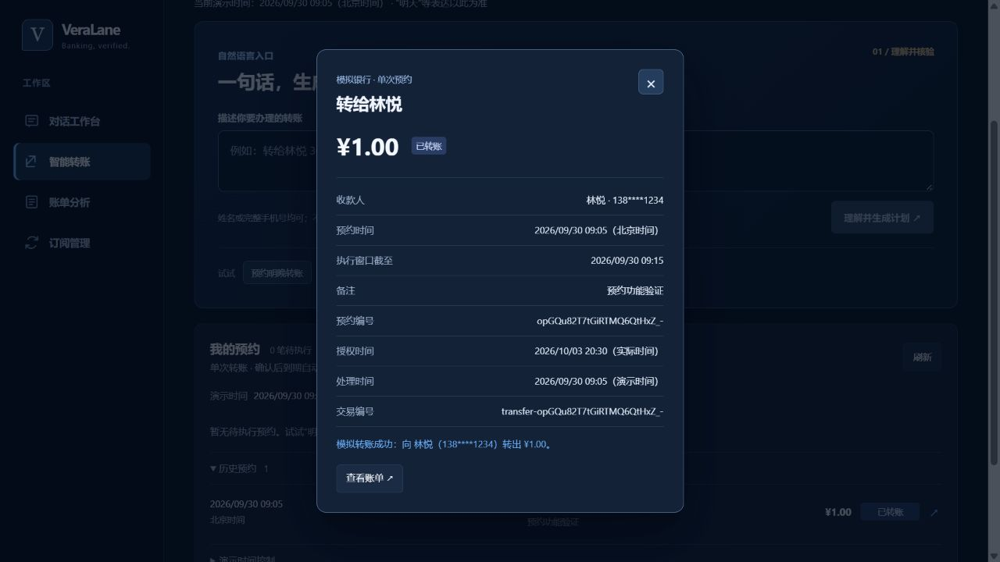

# 智能预约转账验收记录

日期：2026-10-03。范围：本地虚构账户、单次预约、持久化演示时钟。

## 自动验证

- 后端：在 `backend` 执行 `.venv/Scripts/python.exe -m pytest -q`，**116 项通过**。
- 覆盖原有 14 项工作流、65 项时间/金额理解用例及 37 项预约集成用例。
- 前端：`npm run lint`、`npm run build` 均通过。
- 后端仅有已有的 Starlette/httpx TestClient 弃用提示。

关键不变量：未确认不创建可执行预约；提前不扣款；重复确认/并发扫描/重启不重复记账；取消与执行结果一致；余额不足、超限或联系人变化不扣款；短时确认与业务时钟分离；错过窗口不补扣；调度时间列必须匹配授权；故障时整笔账务回滚；备注不能补入收款人或金额。

## 浏览器验证

1. 输入“今天09:05给林悦转1元，备注预约功能验证”，生成完整北京时间确认卡。
2. 勾选并确认，任务显示待执行；刷新后仍保留。
3. 推进演示时间到 09:05，任务显示已转账，回执含唯一交易编号。
4. 新建 09:10 的 2 元预约，在明细中二次确认取消，状态显示已取消。
5. 验证 Escape 关闭弹窗、320px/390px/768px 布局无横向溢出；默认桌面视口正常。
6. 本轮浏览器控制台未观察到错误或警告。

上述 UI 验证留下 1 笔 1 元模拟交易和 1 笔已取消预约，未连接真实银行。演示时钟推进至 2026-09-30 09:05。

本轮自然语言验证使用本地规则模式，未额外调用付费 DeepSeek API。结果仅证明本地原型的这些用例通过，不代表已完成比赛全场景评测、正式身份认证或外部银行接入验证。

