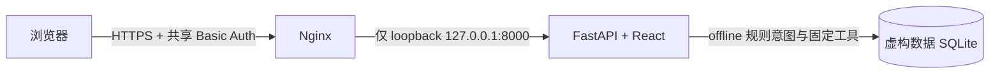

# VeraLane 部署说明

版本日期：2026-10-09

本文说明如何在本地复现 VeraLane，以及当前竞赛演示服务器的访问边界。VeraLane 是共享虚构账本的竞赛原型，不是银行服务。不要接入真实账户、个人身份信息或真实资金。

## 当前云端演示

- 入口：<https://demo.wuyeni.cn>
- TLS 入口：阿里云 ECS（`106.15.77.40`）上的 Nginx；80 端口跳转 HTTPS，443 端口校验 TLS 并要求共享 HTTP Basic Auth。
- 应用：Podman/Docker 兼容容器，由 `veralane-app.service` 管理；容器端口只映射到 `127.0.0.1:8000`。
- 数据：独立持久目录 `/var/lib/veralane-demo/veralane.sqlite3`，全部是虚构演示数据。
- 模型：`VERALANE_MODEL_MODE=offline`，`DEEPSEEK_API_KEY` 为空，不会外呼模型。
- 凭据：演示用户名和口令通过受控渠道单独发送，**不写入仓库、本说明、PPT 或源码包**。一个共享 Basic Auth 口令不等于应用登录、MFA 或真实用户身份认证。



公网入口仅供受控比赛演示。Basic Auth 由 Nginx 对页面和 API 一并执行；应用自身仍没有用户认证或多账户隔离。不要将该原型视为生产系统。

## 本地快速启动

环境：Windows 10/11、Python 3.11+、uv、Node.js 20.19+（或 22.12+）和 npm。

```powershell
.\scripts\run-demo.ps1
```

脚本会构建前端、启动后端并打开 `http://127.0.0.1:8000`。默认监听回环地址，默认离线模式。配置 `.env` 时复制 `.env.example` 并按需修改；不要把 `.env` 提交或放入源码压缩包。

也可以手动启动：

```powershell
cd frontend
npm ci
npm run build
cd ../backend
uv sync --frozen
uv run --frozen --env-file ../.env uvicorn app.main:app --host 127.0.0.1 --port 8000
```

运行全量验证：

```powershell
.\scripts\verify.ps1
```

## 容器构建

仓库 `deploy/Dockerfile` 使用 Node.js 22 构建 React 前端，使用 Python 3.12 和 `uv.lock` 安装后端。OCR 运行时使用 headless OpenCV wheel，避免 GUI 系统库依赖。

在支持 Docker 的主机上从仓库根目录执行：

```bash
docker build -f deploy/Dockerfile -t veralane:competition .
install -d -m 700 /var/lib/veralane-demo
chown 10001:10001 /var/lib/veralane-demo
docker run -d --name veralane-app \
  -p 127.0.0.1:8000:8000 \
  -v /var/lib/veralane-demo:/data \
  -e VERALANE_DB_PATH=/data/veralane.sqlite3 \
  -e VERALANE_MODEL_MODE=offline \
  -e DEEPSEEK_API_KEY= \
  -e VERALANE_DEMO_CONTROLS=1 \
  --restart unless-stopped veralane:competition
```

不要将 `8000` 映射到公网地址。若在公网演示，必须在 Nginx 等受管反向代理处终止 TLS，并对页面/API 一起加访问控制；配置样例见 `deploy/nginx/veralane-demo.conf`。证书文件和 HTTP Basic Auth 密码文件由服务器单独管理，不放入 Git。

在当前 Podman 兼容服务器上，systemd unit 由 Podman 生成并启用，确保开机启动：

```bash
docker generate systemd --new --name veralane-app > /etc/systemd/system/veralane-app.service
sed -i 's/WantedBy=default.target/WantedBy=multi-user.target/' /etc/systemd/system/veralane-app.service
systemctl daemon-reload
systemctl enable --now veralane-app.service
```

## 运维与验收

```bash
systemctl status veralane-app.service
journalctl -u veralane-app.service -n 100 --no-pager
docker logs --tail 100 veralane-app
curl -fsS http://127.0.0.1:8000/api/health
nginx -t && systemctl reload nginx
```

公网未认证健康请求应返回 `401`，HTTP 首页应返回跳转 HTTPS 的 `301`。登录后才可访问演示页面和 API。数据库在 `/var/lib/veralane-demo`，备份前应停止或一致性复制容器数据；不得将服务器数据库打进源码包。

## 源码包内容与排除项

源码归档仅包含 Git 管理的源码、锁文件、文档、演示证据截图、部署配置和启动/验证脚本。`.env`、SQLite 数据库、日志、`.git`、`node_modules`、虚拟环境和构建缓存均排除。压缩包不包含 Basic Auth 口令哈希、TLS 私钥或任何模型 API 密钥。

## 已知部署边界

云端演示使用一个共享 Basic Auth 口令，没有应用级用户身份、MFA、角色或账户隔离。入口虽有 TLS 和口令门禁，仍有公网攻击面；不具备生产级抗暴力猜测、灾备和独立渗透测试结论。完整风险和权限级别见 [安全自评与权限分级](安全自评与权限分级.md)。
