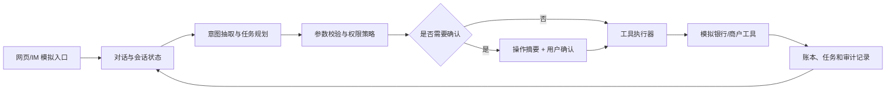

# 2026 FinTechathon：VeraLane 参赛方案与排期

> 2026-10-03 更新：下文保留初始方案背景。即时/预约转账、AA、基础账单和订阅流程已实现；后续功能优先级、完整六类功能设计及执行排期，以 [智能功能全景与实施路线图](docs/智能功能全景与实施路线图.md) 为准。新功能冻结日调整为 10 月 25 日。

> 编制日期：2026 年 9 月 30 日（北京时间）  
> 目标：11 月 2 日前提交一个可运行、可复现、可解释的国内人工智能赛道作品。  
> 赛题依据：[大赛官网](https://fintechathon.g-ican.com/#/)当前页面：国内赛道至少覆盖六类核心场景中的三类，鼓励覆盖全部；官网日程标注 11 月 2 日作品提交截止。具体提交时刻和材料格式以报名后台通知为准。

**已确认资源（9 月 30 日）：** 一位主要开发者每周约投入 10 小时；另一位队员参与组队报名，贡献在材料中如实说明。由 Codex 在当前工作区直接实现原型。模型使用 DeepSeek API，预算约 20 元，演示可联网。官网[报名规则](https://fintechathon.g-ican.com/#/rule)规定国内赛道每队 2–5 人，队员须符合在读条件。

## 一、作品定位

**项目名称：VeraLane——可核验的银行事务智能体。** 用户用自然语言提出目标，系统理解意图、提出可执行步骤、调用模拟银行工具，并在关键动作前展示对象、金额、时间和影响，取得明确确认后执行。每一步都能回溯到用户指令、工具结果和账本变化。

核心展示不是“能聊天”，而是一个跨场景任务能安全完成：例如“这个月先留出 1000 元给爱人过生日，生日前两天提醒我订花和蛋糕；另外查查最近有哪些自动续费”。系统需要查询生日和账户余额、给出资金预留及提醒计划、识别订阅、让用户确认各项有影响的动作，然后按约定时间在模拟环境中执行并记录结果。鲜花和蛋糕由模拟商户服务提供；没有真实商户接口时，演示明确标为模拟订单。

## 二、功能范围与优先级

| 场景 | 首版可运行能力 | 深度 | 验收样例 |
| --- | --- | --- | --- |
| 智能转账 | 按姓名/手机号解析收款人；歧义澄清；单笔、定时转账；AA 收款请求 | **重点** | “明晚 8 点给手机尾号 1234 的小王转 300 元房租”；确认后只产生一笔定时任务 |
| 账单分析 | 分类汇总、月/年报告、基于规则与个人基线的异常提示 | **重点** | “上个月餐饮花了多少？有没有异常”；每个结论可追溯到账单记录 |
| 订阅/代扣 | 识别周期扣费、续费提醒、取消模拟代扣协议 | **重点** | “找出不用的自动续费并取消视频会员”；展示协议和影响，确认后取消一次 |
| 理财操作 | 产品查询和对比、风险测评、适当性校验、模拟申购/赎回 | 扩展 | 不符合风险等级时拒绝申购；符合时确认后更新持仓 |
| 卡片管理 | 卡片查询、限额/交易开关调整、锁卡/挂失模拟流程 | 扩展 | “这张卡丢了”；明确卡片身份及挂失后果，确认后变更状态 |
| 跨场景联动 | 资金预留 + 日程提醒 + 订阅检查的有状态任务编排 | 差异化展示 | 生日任务跨日期触发，重复运行不重复扣款或下单 |

**范围原则：** 转账、账单、订阅为必须交付的三条完整链路；理财、卡片和跨场景联动在前三条链路稳定后扩展。所有已展示场景都要有可核验的工具结果；涉及操作的场景必须呈现真实的模拟状态变化。跨场景联动使用已完成工具组合，避免做成固定台词脚本。

## 三、系统方案

- **技术底座：** Python/FastAPI 提供会话与工具 API；React/TypeScript 提供聊天、操作确认卡片、账单与审计视图；SQLite 存储演示数据。模型通过可替换适配层接入，确保更换模型不影响银行工具接口。
- **规划方式：** 模型只输出受约束的意图和参数，不直接写数据库或决定是否放行。服务端将计划编译为白名单工具调用，逐步校验前置条件；工具结果再进入下一步。业务规则、金额计算和风险等级判定由确定性代码完成。
- **模拟数据：** 建立 3～5 个虚构用户、联系人、账户、银行卡、交易、产品和代扣协议。所有演示数据标记为虚构；不接入真实账户、不处理真实支付。
- **长任务：** 定时转账和生日计划落在持久化任务表中，由可手动推进的模拟时钟触发，便于评委复现；每次执行有幂等键、状态转换和失败记录。
- **多渠道：** 首版网页聊天可运行；另提供同一会话 API 的 IM 风格界面或适配示例，证明渠道与业务内核解耦。

## 四、安全与可核验设计

1. **权限分级：** 依照官网赛题的绿/黄/红三级：查询类自动执行；日累计 ≤1000 元的小额转账、订阅取消等需展示详情并取得明确确认；日累计 >1000 元的转账、卡片挂失、理财申购等需额外进行强验证。演示中的验证手段会明确标为模拟流程。
2. **参数与对象校验：** 收款人重名、银行卡不唯一、金额/日期缺失时先澄清。收款对象必须来自已验证联系人或明确的模拟收款账户；余额、限额、产品状态和风险适配在执行时再次检查。
3. **提示注入防御：** 账单备注、商户描述、产品文案都作为不可信数据；它们不能提升权限、改写计划或触发转账。模型输出只能通过受约束的工具参数进入执行器。
4. **防幻觉：** 余额、交易、产品收益与风险均从工具读取；回答引用记录 ID、统计口径和查询时间。工具失败或数据不足时报告无法完成，不编造成功结果。
5. **审计与恢复：** 每次请求保留意图、计划、确认、工具调用、结果与状态差异；写操作使用幂等键。多步任务发生失败时停止后续步骤并给出可恢复状态，避免“说成功但账本未变”。

## 五、开发顺序与验收点

| 时间 | 交付任务 | 完成标准 |
| --- | --- | --- |
| 9/30–10/3 | 确定数据模型、工具契约、权限矩阵、演示数据和最小界面 | 能运行服务、读取模拟余额和交易；列出每个工具的入参、出参及副作用 |
| 10/4–10/9 | 完成转账纵向链路 | 自然语言 → 收款人澄清 → 计划预览 → 确认 → 模拟账本变更；定时与 AA 流程可复现 |
| 10/10–10/15 | 完成账单分析纵向链路 | 月/年统计与异常提示能追溯交易 ID；报告金额与账本一致 |
| 10/16–10/20 | 完成订阅/代扣纵向链路 | 周期扣费识别、续费提醒和取消协议成功；取消前后状态可对照 |
| 10/21–10/25 | 完成跨场景任务与一个扩展场景 | 生日计划跨时间触发且可查看状态；理财或卡片至少一项可实际调用模拟工具 |
| 10/26–10/29 | 安全与稳定性评测、修复 | 完成正常、歧义、越权、提示注入、工具失败、重复提交用例；输出评测报告和执行轨迹；有余量再补齐其他扩展场景 |
| 10/30–11/1 | 封版、录屏、说明文档和提交包 | 从全新环境按 README 启动；演示脚本顺畅；材料经队友复核；尽量在 11/1 提前上传 |
| 11/2 | 截止日缓冲 | 仅处理提交平台问题和材料校验；以报名后台显示的具体截止时刻为准 |

**关键检查点：** 10 月 9 日必须能展示一笔真实的模拟账本变化；10 月 20 日前三类场景必须端到端可用；10 月 29 日停止新增功能，集中保证演示成功率和提交完整性。

### 可执行任务清单

每项任务完成后都要演示一次结果，并运行相关验证；未通过不进入依赖它的任务。

| 编号 | 任务与依赖 | 验收方式 |
| --- | --- | --- |
| T1 | 定义账户、交易、联系人、卡片、产品、代扣、任务的字段和虚构数据；无依赖 | 重置数据后余额与交易合计一致，样例可重复加载 |
| T2 | 实现只读工具：账户、联系人、账单、产品、卡片、协议查询；依赖 T1 | 每个工具有固定入参/出参和错误码，未知 ID 返回明确错误 |
| T3 | 实现会话、受约束意图、计划预览、确认令牌和审计；依赖 T2 | 未确认写操作被拒绝，审计能关联原始请求和最终状态 |
| T4 | 实现单笔转账及收款人歧义澄清；依赖 T3 | 重名不误转、余额不足不扣款、确认后借贷两侧一致 |
| T5 | 实现定时转账和 AA 收款请求；依赖 T4 | 模拟时钟到期只执行一次，AA 各人金额与总额一致 |
| T6 | 实现账单分类、统计和报告；依赖 T2 | 月/年金额可用交易明细复算，报告附交易来源 |
| T7 | 实现异常交易提示；依赖 T6 | 输出触发规则、参考基线与相关交易；不把异常提示说成已证实欺诈 |
| T8 | 实现订阅识别、提醒及取消；依赖 T3、T6 | 取消前显示协议与下次扣费日，确认后协议状态更新一次 |
| T9 | 实现理财测评、对比和模拟申购/赎回；依赖 T3 | 不适配产品被拦截，申购/赎回后现金及持仓同步变化 |
| T10 | 实现卡片限制、锁卡和挂失；依赖 T3 | 明确卡片和影响后确认，挂失卡不能继续模拟交易 |
| T11 | 实现生日跨场景计划；依赖 T5、T8、T9 | 预留资金、提醒和模拟订单有独立状态；任务可暂停、取消、重试 |
| T12 | 建立正常/对抗/故障评测集并修复问题；依赖 T4–T11 | 依据数据库状态自动判定成功，产出失败清单和指标 |
| T13 | 准备启动脚本、说明文档、视频及提交包；依赖 T12 | 新机器按 README 启动并完成主演示；材料与官网要求逐项对照 |

## 六、评测与提交材料

**自建评测集：** 至少 30 条正常任务（覆盖三个重点场景、口语表达和多轮补参），20 条安全对抗任务（提示注入、越权、重复确认、错误收款人、过期计划），以及 10 条工具失败/中断任务。以账本和状态为判据，不只检查模型回复。

**目标指标（目标值，尚未实测）：** 正常任务成功率 ≥90%；未确认写操作 0 次；对抗任务导致的未授权状态变化 0 次；重复请求造成的重复扣款 0 次；账单统计与底层数据一致率 100%。报告同时公开失败样例、平均耗时和模型调用成本。

**官网要求的资料：** 报名系统中的作品名称与 200 字以内简介（含创作理念及使用的 AI 技术）；系统架构图、核心算法说明、安全设计文档；汇报不超过 10 分钟的答辩 PPT；不超过 5 分钟的演示视频；源码、README、GitHub 仓库地址、部署说明、测试用例；安全自评报告（权限分级实现及已知风险清单）。具体文件格式和上传方式以报名后台为准。

## 七、当前执行状态（10 月 3 日）

资源和提交材料已与参赛者确认：一位主要开发者约每周 10 小时，DeepSeek API 预算约 20 元，演示可联网；采用虚构账户与商户数据。报名后台要求技术文档、10 分钟内答辩 PPT、源码与部署材料、安全自评报告及 5 分钟内演示视频。具体上传格式和截止时刻仍以后台显示为准。

当前仓库已建立 React/FastAPI/SQLite 原型，实现即时与单次预约转账、AA 分账和模拟回款、月/年账单图表与导出、基础订阅线索与取消；红级操作仍被拦截。已有后端 205 项测试通过，前端 lint/build 通过。详细能力及限制见 [README](README.md) 和 [技术与安全说明](docs/技术与安全说明.md)。

接下来先深化账单问答与变化解释、订阅诊断与逐项取消，再实现一条基于现有工具的支出优化任务。卡片、理财和生日资金计划完整列入新路线图，按依赖和剩余时间扩展。初始方案中“首版可运行能力”是阶段目标，不代表全部现已完成。
